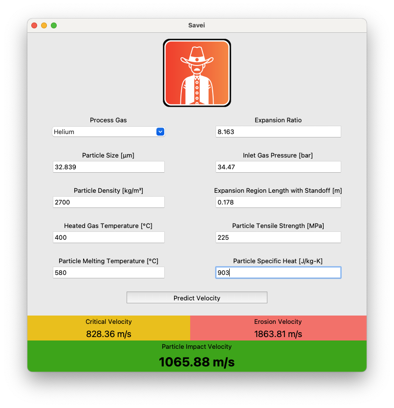
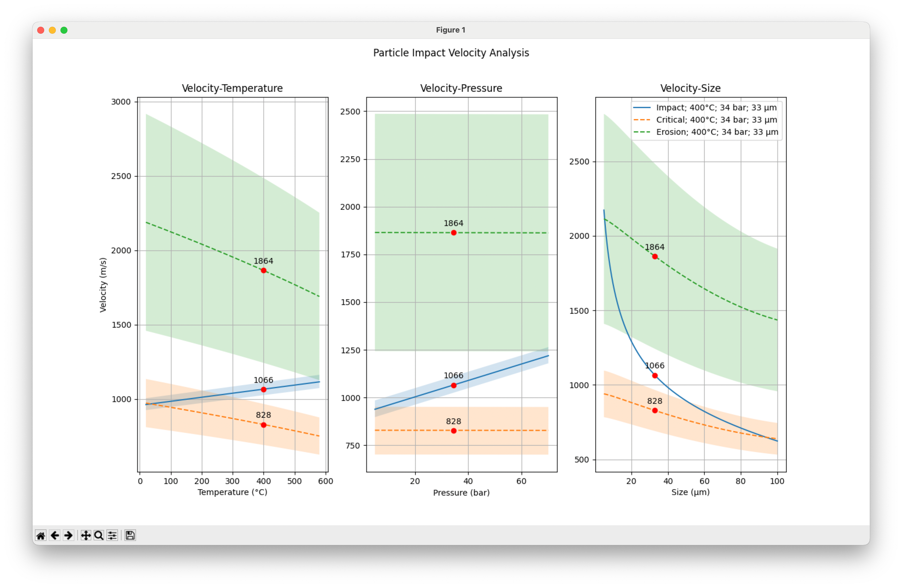

# Savei

Predicts particle impact velocity of cold spray systems.

## What is Savei?

Savei is a Python-based application designed to predict particle impact velocity in cold spray additive manufacturing processes. This tool aims to assist engineers and researchers in optimizing and analyzing cold spray techniques by providing accurate velocity predictions based on various input parameters.

### ⚠️ DISCLAIMER ⚠️

This tool is intended for educational and research purposes only. It is your responsibility to ensure that any use of this tool complies with all applicable laws and regulations. The developers and contributors of this project are not responsible for any misuse or consequences arising from the use of this tool.

## Features

- Make predictions using advanced computational models.
- Includes particle critical velocity and particle erosion velocity.
- Easy-to-use graphical user interface.
- Visualizes data and predictions.

## Installation

### Setup

1. **Clone the Repository**

   ```bash
   git clone https://github.com/noahnle/savei.git
   cd savei
   ```

2. **Create and Activate a Virtual Environment**

   ```bash
   python3.11 -m venv savei-venv
   ```

   ```bash
   source savei-venv/bin/activate  # On Windows: savei-venv\Scripts\activate
   ```

3. **Install Dependencies**

   ```bash
   pip install -r requirements.txt
   ```

#### Note

Tkinter is included with most Python installations, but it may not be available in some versions. If you encounter issues, verify that Tkinter is included in your Python installation. I recommend to use Python 3.11.

## Usage

1. **Run the Application**

   ```bash
   python savei.py
   ```

2. **Using the GUI**

   1. Input the necessary parameters for your cold spray system.
   2. Click the "Predict" button to compute the particle impact velocity.
   3. View and analyze the results displayed in the application.

### Example




## Tests

### Overview

Savei was validated using a single spray data set to assess its accuracy in predicting particle impact velocity.

### Testing Methodology

1. **Parameter Testing**: The tool was tested using parameters from a single spray data set. This involved analyzing clumps of particles grouped together and assigned a specific speed.

2. **Validation with Experimental Data**: The validation was performed using experimental data from one spray, where the largest cluster of particles traveled at a speed of approximately 1034.51 m/s. Using the same parameters and the average size for this data set, Savei predicted a speed of 1065.88 m/s.

### Results

- **Accuracy**: Achieved 97.06% accuracy for the single spray data set used in validation.
- **Observations**: The tool’s prediction was very close to the actual measured speed, indicating its effectiveness in predicting particle impact velocities for the tested parameter.

## Contributing

Pull requests are welcome! For major changes, please open an issue first to discuss what you would like to change.

## License

This project is licensed under the MIT License - see the [LICENSE](https://github.com/noahnle/savei/blob/main/LICENSE) file for details.

## Acknowledgments

Savei was developed as a senior design project at my university. We are grateful for the university's support and resources.

Special thanks to our mentors for their invaluable guidance and expertise throughout the project. We also appreciate the Department of Defense for their support in testing and validating the application's predictive capabilities.

The following sources were crucial in shaping the equations and concepts used in Savei:

- **Assadi, H., Schmidt, T., Richter, H., Kliemann, J.-O., Binder, K., Gärtner, F., Klassen, T., & Kreye, H.** (2011). _On Parameter Selection in Cold Spraying_. Journal of Thermal Spray Technology, 20(6), 1161–1176. [DOI: 10.1007/s11666-011-9662-9](https://doi.org/10.1007/s11666-011-9662-9)

- **Arbegast Materials Processing and Joining Lab**. (2012). _Cold Spray: A Guide to Best Practice_. South Dakota School of Mines and Technology, Rapid City, SD.

- **Champagne Jr., V. K., Ozdemir, O. C., & Nardi, A.** (Eds.). (2020). _Practical Cold Spray_. Springer. ISBN 978-3-030-70055-3; ISBN 978-3-030-70056-0 (eBook). [DOI: 10.1007/978-3-030-70056-0](https://doi.org/10.1007/978-3-030-70056-0)

- **Zou, Y.** (2021). _Cold Spray Additive Manufacturing: Microstructure Evolution and Bonding Features_. _Accounts of Materials Research_, 2, 1071−1081. [DOI: 10.1021/accountsmr.1c00138](https://pubs.acs.org/doi/10.1021/accountsmr.1c00138?ref=pdf)
